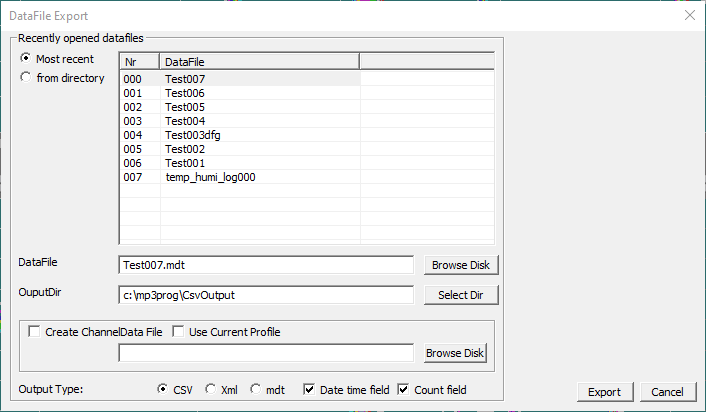

# Exporting a datafile
When recording data in Mp3, measurements are stored to disk in binary format with the extension `*.mdt`. These files can only be opened with specific software. 

In order to use the data for further analysis you must export this data. Exporting can be done by to `Tools` → `Export datafile`. The `DataFile Export` window wil open. 


/// caption
Export datafile dialog in Mp3
///

# CSV file structure
The exported files are structured as follows:

- First row has the filename
- Second row lists the names of the columns
- Third row denotes the mode of the channel

See an example below.

```
DataFile;temp_humi_log000
Index;Date;Time;Counter;Temp 1;Humi 1;Temp 2;Humi 2;Temp 3;Humi 3;Temp 4;Humi 4;
 ; ; ; ;Filtered;Filtered;Filtered;Filtered;Filtered;Filtered;Filtered;Filtered;
        0;45730.730333; 0.000000;        1;  22.000000;  27.900000;  22.100000;  27.800000;  20.900000;  28.500000;  21.000000;  28.900000;
        1;45730.732639;199.227000;        1;  21.800000;  28.100000;  21.900000;  27.900000;  21.000000;  28.400000;  21.100000;  28.900000;
        2;45730.736111;499.227000;        1;  21.700000;  28.100000;  21.800000;  28.000000;  21.200000;  28.200000;  21.200000;  28.800000;
        3;45730.739583;799.227000;        1;  21.600000;  28.100000;  21.800000;  27.900000;  21.200000;  28.000000;  21.200000;  28.700000;
        4;45730.743056;1099.227000;        1;  21.600000;  27.800000;  21.700000;  27.600000;  21.300000;  27.700000;  21.300000;  28.500000;
        5;45730.746528;1399.227000;        1;  21.500000;  27.800000;  21.700000;  27.600000;  21.300000;  27.800000;  21.300000;  28.700000;
...
```

The columns `Index`, `Date`, `Time` and `Counter` are always present. The rest of the columns depend on the profile setup in Mp3.

The `Index` value is an incremental number starting at 0 for the first sample.

The `Date` value denotes the number of days passed since 01-01-1900. The decimal part is in fractions of a full day.

The `Time` value denotes the number of seconds passed since 00:00 of the day in the `Date` field.

The `Counter` value indicates a number of counts that can be setup in the profile in Mp3.

# Python