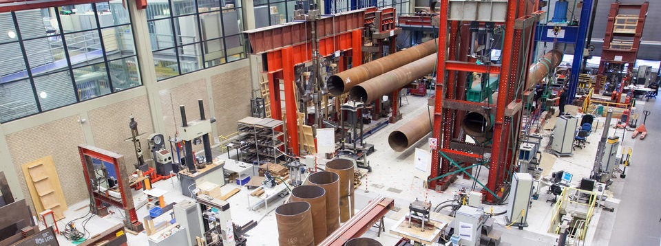

# Stevin laboratory
The Macrolab (also known as the Stevinlab / Stevin Laboratory) is a large-scale structural testing facility at Delft University of Technology (TU Delft) in the Netherlands. 

It is part of the department of Engineering Structures and is used for experimental research on structures: validating models, comparing experiments with simulations, and running contract research for both public authority clients and commercial companies.

At the Stevin laboratory some of the largest scale tests can be conducted in the Netherlands and sometimes the world. Among these exceptional tests it is possible for large scale concrete beams and plates to be tested in 1-, 2- and 3-point bending.

Learn more about our faculty [here](https://www.tudelft.nl/en/ceg).

# History
The lab was built between 1657 and 1969.