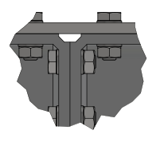

# Bolted connections (HV)
Important to know is that we don't use regular bolts and nuts for the assembly of mechano frames. Bolting of frame members should be done with bolts, washers and nuts from the HV-system. These comply to EN 14399 and are able to be pre-tensioned properly and reliably.

The nuts and bolts both have a larger hex size compared to regular nuts and bolts, SW41 instead of SW36, and are marked with "HV".

