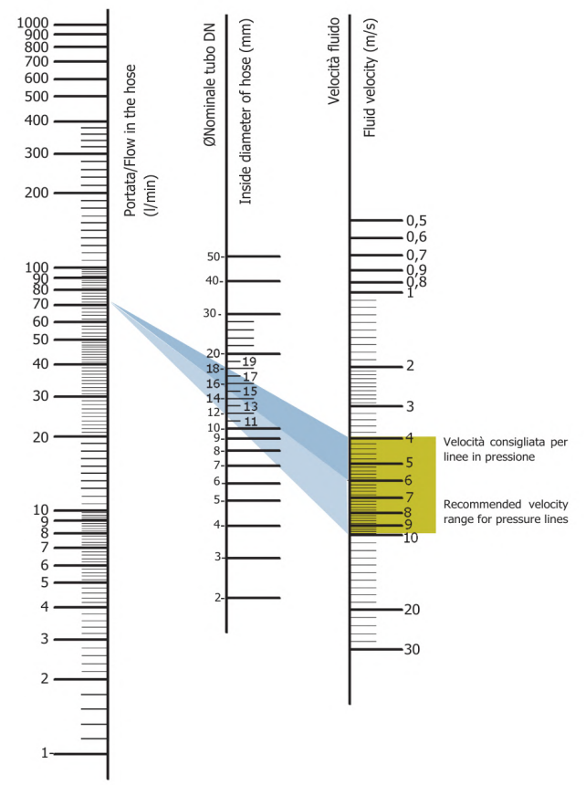

# Flow nomogram
For assembled hoses
Example: establish the min diameter of the hose for a flow of 70 l/m. Draw a line from 70 l/m flow to 6 m/s fluid velocity. This line intersects the straight line of diameter at 15.5 mm. This is the ideal nominal diameter of the hose. Based on Hazen-Williams formula.

{ width="300" }
/// caption
A hydraulic flow nomogram is a graphical tool used to size hoses, pipes, or tubes by finding the intersection of known flow rate (GPM/LPM) and recommended fluid velocity (ft/s or m/s) to determine the required internal diameter (ID). It simplifies calculations regarding fluid velocity, preventing excessive pressure drops, overheating, or system damage. 
///