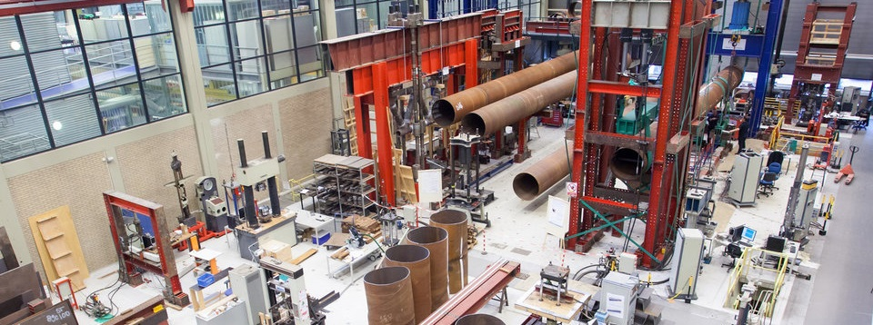

Welcome to the Macrolab knowledge base. Here you'll find a collection of information pieces, explainers, examples and more regarding technology used in our lab. The focus of this knowledge base is on [[Data-aquisition]] and [[Control systems]], however you will also find information on other related subjects.

# Stevin laboratory
The Macrolab is also known as the Stevin laboratory and is part of the faculty of Civil Engineering and Geosciences at the TU Delft in the Netherlands.

At the Stevin laboratory some of the largest scale tests can be conducted in the Netherlands and sometimes the world. Among these exceptional tests it is possible for large scale concrete beams and plates to be tested in 1-, 2- and 3-point bending.

Learn more about our faculty: https://www.tudelft.nl/en/ceg

# About
This knowledge base is written by technicians working in the lab. The main purpose of this knowledge base is to provide information and references to the way things are done here. Hopefully this information is helpful when designing new testing setups or troubleshooting existing ones.