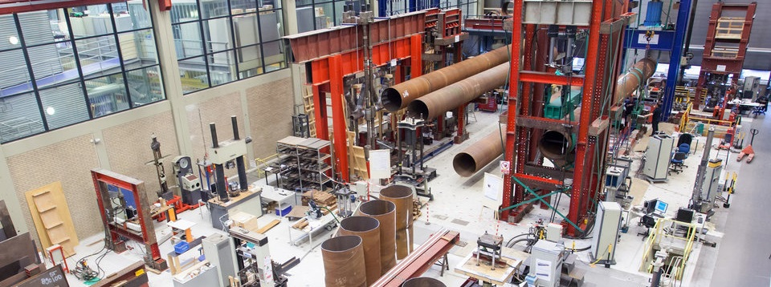
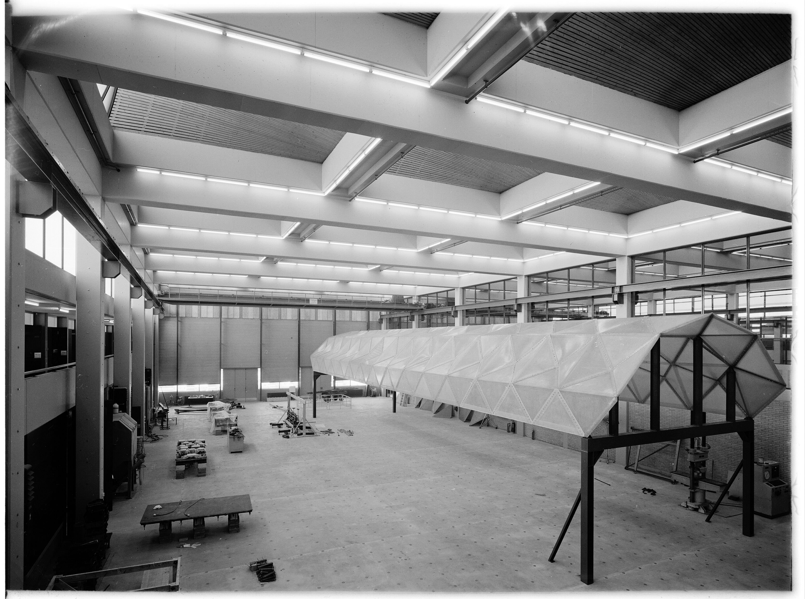
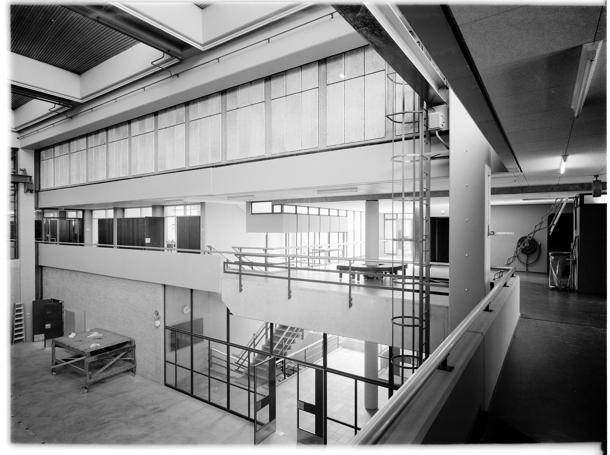
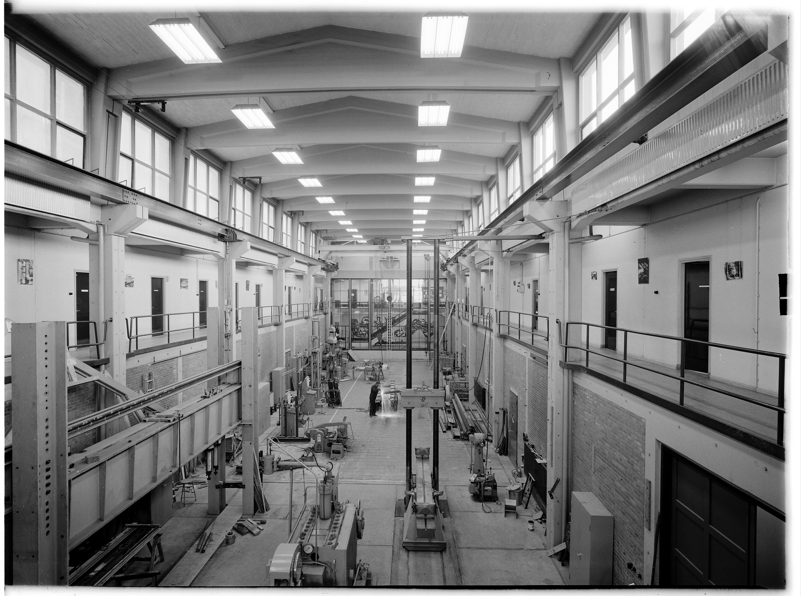

# Stevin laboratory
The Macrolab (also known as the Stevinlab / Stevin Laboratory) is a large-scale structural testing facility at Delft University of Technology (TU Delft) in the Netherlands. 

It is part of the department of Engineering Structures and is used for experimental research on structures: validating models, comparing experiments with simulations, and running contract research for both public authority clients and commercial companies.

At the Stevin laboratory some of the largest scale tests can be conducted in the Netherlands and sometimes the world. Among these exceptional tests it is possible for large scale concrete beams and plates to be tested in 1-, 2- and 3-point bending.

Learn more about our faculty [here](https://www.tudelft.nl/en/ceg).

# History
The Stevin halls were designed by architect D. van Rosenburg, and they were already standing before the main CiTG (Civil Engineering and Geosciences) building began construction in 1957. The main CiTG building was later connected to the labs via what have been described as fin-like aerial bridges.

Stevin 2 in particular is considered architecturally strong, designed by the renowned firm Van den Broek en Bakema. It is characterized by a rigid column-and-beam structure, a spatially interesting shed roof construction, and an industrial character overall.

Read more about the buildings [here](../media/Gebouwencomplex-voor-Civ.-TH-Delft.pdf) (in Dutch).

{width="49%" loading=lazy}
{width="49%" loading=lazy}

## Stevin I
{width="49%" loading=lazy align=right}

Before Stevin II existed, research experiments were performed in the Stevin I laboratory, formerly known as "laboratorium voor Toegepaste Mechanica en Onderzoek van Constructies" (laboratory for applied mechanics and research on structures). 

This lab was dismantled in 2004. Since fall of 2006 TU Delft Dream Teams have been using the building.

