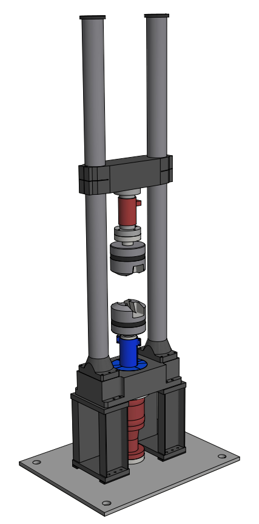
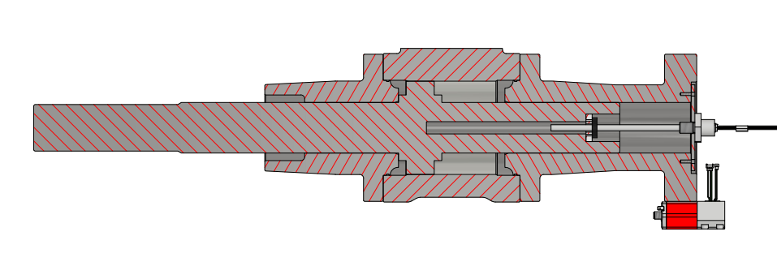

{align=right}

## Specifications
**Machine loadcell:**

- LEBOW 3117-100k
- Capacity: 100000 LBS (445 kN)
- Serial nr.: 664

**Servovalve**

- Moog G761-3015
- Type: S65JOGM4VPY
- Serial nr.: 5636
- Date: 07-2004

## Upgraded displacement transducer 2025
The original LVDT displacement transducer was no longer reliable. There were spurious peaks in it's output signal, so we decided to upgrade to a modern magnetostrictive transducer.

We chose the Temposonics R-Series V RDV (RDV-C-6-0120M-01-D34-1-V102), with analog voltage output. 

!!! warning 
    There was a misunderstanding when upgrading the machine. The displacement range was actually bigger than the transducer we've purchased. This means there's a few milimeters of stroke at the bottom end, where no valid position is measured. At some point we'll purchase a longer transducer to fix this.

/// caption
Cross section of the actuator from the Dowty Rotol machine, showing the new magnetostrictive transducer in place.
///