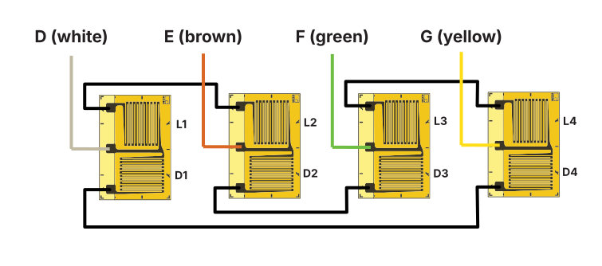

## Initial design calculations
|   |   |
|---|---|
| Force limit $F_{max}$           | 200 kN       |
| Measured strain at max load $\epsilon$ | 2000 $\upmu\upepsilon$            |
| Youngs modulus of steel ($E$)            | $210\mathrm{MPa} = 210 \mathrm{N/mm^2}$  |

Relationship between strain, stress, force and area

$$
\begin{gathered}
\epsilon=\frac{\sigma}{E} \enspace\rightarrow\enspace \sigma=\epsilon E \cr
F=\sigma\cdot A \enspace\rightarrow\enspace F=\epsilon\cdot E\cdot A \enspace\rightarrow\enspace \frac{F}{\epsilon\cdot E}=A
\end{gathered}
$$

Filling in the numbers, calculating the required area of the cross-section of the active region of the load cell.

$$
A=\frac{200*10^3}{2*10^{-6} \cdot 210*10^6} \enspace\approx 476 \mathrm{mm^2}
$$

The stress in the material.

$$
\sigma=200*10^{-6}\cdot 210\cdot 10^9 \enspace\approx 410 \mathrm{MPa}
$$

## Optimizing the design
If we use four x/y strain gauges (eg. XY71-6/120 from HBM) we can create a double full bridge that's sensitive to strain in the force direction as well as strain caused by the Poisson effect. This will increase the measured strain by a factor of 2.6[^1].
[^1]: Assuming the Poisson's ratio of steel to be 0.30 from [Wikipedia](https://en.wikipedia.org/wiki/Poisson%27s_ratio#Poisson's_ratio_values_for_different_materials)

We can now increase the wall thickness of the active region of the load cell and maintain the same output. Thus increasing the stiffness and resistance to bending.

$$
A^*=A\cdot2.6\approx 1238 \mathrm{mm^2}
$$

The outer diameter of the active region is 60 mm ($r_1 = 30\mathrm{mm}$). We can calculate the inner diameter ($d_2$) as follows:

$$
A=\pi\cdot ({r_1}^2-{r_2}^2) \enspace\rightarrow\enspace d_2=2\sqrt{{r_1}^2-\frac{A}{\pi}} \enspace\approx 45 \mathrm{mm}
$$

The maximal stress in the material is also a lot less now:

$$
\sigma=\frac{200*10^{-6}\cdot 210\cdot 10^9}{2.6} \enspace\approx 158 \mathrm{MPa}
$$

